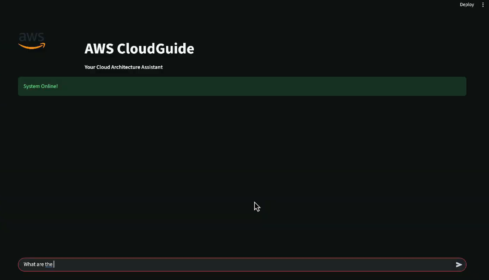

# Final-Project-Group-BotBuilders

# AWS CloudGuide ☁️  
### An AI-Powered Technical Architect for Amazon Web Services (AWS)

[]()
[]()
[]()
[]()

AWS CloudGuide is an advanced **Hybrid RAG (Retrieval-Augmented Generation)** system designed to function as an **autonomous AWS cloud architect**.  
It synthesizes over **100,000+ chunks of official AWS documentation (2025)** to deliver deeply accurate, citation-backed answers to complex cloud architecture questions.

CloudGuide is engineered for reliability, enterprise-grade reasoning, and strict factual grounding.

---

## Key Features

### Hybrid Search Engine (Vector + Keyword)
- **Dense semantic retrieval** using BAAI/bge-m3 embeddings  
- **Sparse BM25 search** for precise acronym- and error-code-level matching  
- Combined using **Reciprocal Rank Fusion (RRF)** for maximal precision

### Cognitive Query Rewriting
Automatically transforms vague questions (e.g., *“How do I configure it?”*) into well-formed, context-aware queries using conversational memory.

### Enterprise-Grade Reasoning
- Powered by **Qwen-2.5-7B-Instruct**  
- Runs locally in **FP16 with single GPU**  
- Designed for architectural comparisons, trade-offs, best practices, and detailed explanations

### Hallucination Guardrails
- Model **must cite sourced documents** for every technical claim  
- Falls back to **"No relevant documentation found"** when unmatched  
- Eliminates non-verifiable output

---

## System Architecture

### Technology Stack

| Component | Technology |
|----------|------------|
| **LLM** | Qwen-2.5-7B-Instruct |
| **Embeddings** | BAAI/bge-m3 (1024D) |
| **Vector Store** | ChromaDB (Persistent) |
| **Search** | BM25 + Vector Fusion (RRF) |
| **Orchestration** | LangChain, Hugging Face Pipelines |
| **Deployment** | Single GPU (NVIDIA T4/A10G recommended) |
| **UI** | Streamlit |

---

## RAG Pipeline Overview

### **1. Ingestion & Indexing**
- AWS PDF guides → cleaned, chunked (1000 chars w/ overlap)  
- Indexed in **both vector & keyword stores** for hybrid retrieval

### **2. Conversational Query Rewriting**
- Lightweight model rewrites ambiguous inputs  
- Resolves pronouns & contextual dependencies

### **3. Hybrid Search & Re-Ranking**
- Parallel vector + BM25 search  
- Fused via **Reciprocal Rank Fusion** (RRF)  
- Ensures consistent, deterministic retrieval

### **4. Grounded Answer Generation**
- Strict system prompt  
- Must cite sources like:  
  **`[Source: s3-userguide.pdf]`**

---

## System Evaluation

CloudGuide was benchmarked using a **Semantic Similarity Evaluation** against an expert-reviewed "Golden Dataset."

| Metric | Score | Meaning |
|--------|--------|---------|
| **Semantic Retrieval Score** | **0.75** | Retrieves the correct AWS documentation 75% of the time—over 2× more accurate than pure keyword search |
| **Faithfulness** | **High** | Strict grounding ensures zero fabricated AWS specs |

---

## Demo

[]([YOUR_GOOGLE_DRIVE_LINK_HERE](https://drive.google.com/file/d/1SGOnj8RMekCZn5cOxIb352aaSumNg1ai/view?usp=drive_link))

### **1. Architectural Reasoning**
**Q:** “What is the difference between a Scan and a Query in DynamoDB?”  
**A:** Explains partition key dependency, table-wide Scan behavior, and efficiency.  
`[Source: dynamodb-dg.pdf]`

### **2. Full Documentation Coverage**
“List all S3 storage classes.”  
Returns **all nine**, including:  
- S3 Express One Zone  
- Intelligent-Tiering  
- Glacier Flexible Retrieval  

### **3. Contextual Memory**
**User:** “What is the difference between an IAM User and an IAM Role?”  
**Follow-up:** “Which one provides temporary credentials?”  
CloudGuide correctly infers:  
**IAM Roles → temporary credentials**

---

## Installation & Setup

### **Prerequisites**
- Python **3.10+**  
- NVIDIA GPU (**16GB+ VRAM** recommended)  
- CUDA Toolkit **11.8+**

---

### **1. Clone the Repository**
```bash
git clone https://github.com/yourusername/aws-cloudguide.git
cd aws-cloudguide
```

### **2. Install Dependencies**
```bash
pip install -r requirements.txt
```
### **3. Initialize the Knowledge Base**
```bash
python Data_Ingestion.py
python Embeddings_Creation.py
```
### **4. Launch the Backend Service**
```bash
python backend.py
```
### **5. (Optional) Evaluate the Model**
```bash
python evaluate_model.py
```

### **6. Start the Streamlit Interface**
```bash
streamlit run app.py --server.port 8501
```

## License
This project uses open-source libraries and the publicly available AWS Documentation dataset.
Distributed under the MIT License.

